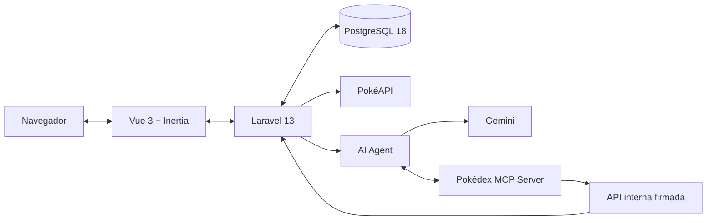

<div align="center">


# Pokédex Manager

**Colección personal, exploración y análisis Pokémon en una experiencia local, adaptable y asistida por IA.**

[](https://laravel.com/docs/13.x)
[](https://www.php.net/)
[](https://vuejs.org/)
[](https://www.typescriptlang.org/)
[](https://www.postgresql.org/)

[Funcionalidades](#funcionalidades) · [Arquitectura](#arquitectura) · [Inicio rápido](#inicio-rápido) · [Configuración](#configuración) · [Calidad](#calidad-y-pruebas)

</div>

Pokédex Manager permite construir una colección Pokémon propia a partir de una Pokédex externa, personalizar cada elemento y analizar la composición resultante. Laravel mantiene la identidad, las reglas y la persistencia; Vue e Inertia ofrecen la experiencia de aplicación; PostgreSQL conserva los datos locales; y Pika IA amplía la consulta y gestión mediante Gemini y herramientas MCP controladas.

## Funcionalidades

- **Cuenta personal:** registro, inicio de sesión, consulta de perfil y cierre de sesión con Laravel Fortify y Jetstream.
- **Mi colección:** búsqueda instantánea por nombre, apodo o número; filtros por tipo y favoritos; ordenamiento; edición de apodo, notas y estado favorito; eliminación con confirmación.
- **Explorar Pokédex:** catálogo paginado, búsqueda por nombre o número, filtro por tipo, ficha individual y alta sin duplicados.
- **Detalle Pokémon:** arte oficial o sprite disponible, tipos, habilidades, altura, peso y estadísticas base.
- **Análisis:** distribución y cobertura de tipos, tipo dominante, tipos ausentes, favoritos y líderes por estadística.
- **Comparador:** comparación lado a lado con el valor ganador de cada estadística.
- **Impacto en la colección:** vista previa de cómo una incorporación o eliminación cambia la diversidad de tipos y los máximos estadísticos.
- **Pika IA:** conversaciones persistentes, contexto de colección, adjuntos de imagen, comparaciones, recomendaciones y acciones de colección sujetas a confirmación humana.
- **Experiencia adaptable:** navegación lateral en escritorio, navegación inferior en móvil, tema claro u oscuro según la preferencia del sistema y estados de carga, error, vacío y sin resultados.
- **Accesibilidad:** HTML semántico, navegación por teclado, foco visible, regiones anunciables, objetivos táctiles y soporte para movimiento reducido.

## Datos y persistencia

La aplicación separa los datos de catálogo de los datos propios de cada cuenta:

| Origen | Responsabilidad |
| --- | --- |
| PokéAPI | Nombres, números, imágenes, tipos, habilidades, dimensiones y estadísticas Pokémon. Las respuestas se normalizan y almacenan temporalmente en caché. |
| PostgreSQL | Usuarios, colección personal, apodos, notas, favoritos, conversaciones, mensajes, metadatos de adjuntos y acciones pendientes de Pika IA. |
| Almacenamiento privado de Laravel | Archivos adjuntos al chat; nunca se publican directamente desde `public/`. |

La restricción única `(user_id, pokemon_id)` evita que una misma cuenta agregue dos veces el mismo Pokémon. El volumen Docker `sail-pgsql` conserva PostgreSQL al detener o recrear los contenedores.

## Arquitectura

El repositorio es una aplicación full-stack organizada como monorepo. Laravel e Inertia comparten el flujo web. El agente de IA (`ai-agent`) y el servidor MCP no publican puertos al host: su comunicación con Laravel ocurre en la red privada de Docker, mientras el agente consume Gemini desde el servidor.



| Componente | Responsabilidad |
| --- | --- |
| Laravel | Autenticación, autorización, validación, casos de uso, acceso a datos, integración con la Pokédex y API interna. |
| Vue + Inertia | Pantallas, navegación, formularios, estados de interfaz y chat adaptable sin duplicar el enrutamiento del servidor. |
| PostgreSQL | Fuente de verdad para identidad, colección y conversaciones. |
| `ai-agent` | Orquestación de Gemini en el servidor, historial reciente, contenido visual y ciclo de herramientas. No accede a PostgreSQL. |
| `pokedex-mcp` | Exposición de herramientas MCP tipadas hacia operaciones acotadas de Laravel. No accede a PostgreSQL. |

### Decisión arquitectónica

El proyecto no implementa Clean Architecture de manera formal. Sigue una arquitectura modular y por capas alineada con las convenciones de Laravel:

- los controladores coordinan solicitudes y respuestas;
- los Form Requests y Policies concentran validación y autorización;
- las Actions representan operaciones de negocio concretas;
- los Services encapsulan integración, composición y análisis;
- los Contracts desacoplan límites externos como la Pokédex y el agente de IA;
- Eloquent mantiene la persistencia sin añadir una capa de repositorios redundante.

Esta estructura conserva responsabilidades claras y dependencias comprobables sin introducir entidades, adaptadores o abstracciones independientes del framework que el alcance actual no necesita. Si el dominio creciera hasta requerir múltiples interfaces, fuentes de persistencia o reglas completamente independientes de Laravel, esas fronteras podrían extraerse de forma incremental.

### Estructura principal

```text
app/
├── Actions/                 # Operaciones de negocio explícitas
├── Contracts/               # Puertos para catálogo y agente
├── Http/                    # Controladores, requests, recursos y middleware
├── Models/                  # Entidades persistidas con Eloquent
├── Policies/                # Autorización y propiedad de recursos
└── Services/                # Pokédex, colección, análisis y asistente
resources/js/
├── Components/              # UI reutilizable por dominio
├── composables/             # Estado y comportamiento compartido
├── Layouts/                 # Estructura adaptable de la aplicación
├── Pages/                   # Pantallas Inertia
├── types/                   # Contratos TypeScript
└── utils/                   # Utilidades de presentación
services/
├── ai-agent/                # Gemini y cliente MCP
└── pokedex-mcp/             # Servidor MCP y cliente de la API interna
database/migrations/         # Esquema PostgreSQL versionado
routes/                      # Rutas web e internas
compose.yaml                 # Aplicación y servicios locales
```

## Tecnologías

| Área | Tecnologías |
| --- | --- |
| Backend | PHP 8.5, Laravel 13, Eloquent, Fortify, Jetstream, Sanctum |
| Frontend | Vue 3, TypeScript, Inertia.js 2, Tailwind CSS, Vite 8 |
| Datos | PostgreSQL 18, sesiones y caché de Laravel respaldadas por base de datos |
| Catálogo | PokéAPI con caché, reintentos acotados y límites de espera explícitos |
| IA | Gemini, SDK oficial `@google/genai`, Model Context Protocol y Zod |
| Calidad | PHPUnit, Vitest, Node Test Runner, Vue Test Utils, vue-tsc y Laravel Pint |
| Entorno | Docker Compose mediante Laravel Sail |

## Requisitos

- [Docker Desktop](https://www.docker.com/products/docker-desktop/) o Docker Engine con Compose. En Windows, Laravel Sail debe ejecutarse desde WSL2.
- PHP 8.5 y [Composer](https://getcomposer.org/) para preparar las dependencias de un clon nuevo.
- [Git](https://git-scm.com/).
- Conexión a internet para consultar la Pokédex y utilizar Gemini.
- Una clave de Gemini únicamente si se utilizarán respuestas reales de Pika IA.
- Puertos `80`, `5173` y `5432` disponibles, o valores alternativos definidos en `.env`.

## Inicio rápido

### 1. Clonar e instalar dependencias PHP

Asegúrate de que Docker esté en ejecución antes de iniciar los servicios.

```bash
git clone https://github.com/EDnny12/pokedex-manager.git
cd pokedex-manager
composer install
```

`composer install` crea `vendor/`, donde vive el ejecutable de Laravel Sail utilizado para administrar Docker.

### 2. Preparar el entorno

```bash
cp .env.example .env
alias sail='sh $([ -f sail ] && echo sail || echo vendor/bin/sail)'
```

> [!TIP]
> Agrega el alias anterior a `~/.zshrc` o `~/.bashrc` para disponer del comando `sail` en futuras terminales. Funciona en macOS, Linux y terminales WSL2 con Bash/Zsh; no en PowerShell o CMD nativos. El alias es una preferencia local y no se versiona.

### 3. Iniciar la aplicación

```bash
sail up -d
sail artisan key:generate
sail artisan migrate
sail npm ci
sail npm run build
```

En el primer arranque, Docker instala y compila automáticamente las dependencias de `ai-agent` y `pokedex-mcp` antes de iniciar Laravel.

Abre [http://localhost](http://localhost). Para trabajar con recarga en caliente, ejecuta en otra terminal:

```bash
sail npm run dev
```

> [!NOTE]
> La Pokédex funciona sin clave de API. Sin `GEMINI_API_KEY`, la aplicación y sus funciones principales siguen disponibles, pero Pika IA no puede generar respuestas reales.

## Configuración

`.env.example` contiene valores seguros para desarrollo local. Copia el archivo a `.env` y ajusta únicamente lo necesario.

### Aplicación y base de datos

| Variable | Valor local predeterminado | Uso |
| --- | --- | --- |
| `APP_URL` | `http://localhost` | URL base de Laravel y origen de autenticación. |
| `APP_PORT` | `80` | Puerto HTTP expuesto al equipo local. |
| `VITE_PORT` | `5173` | Puerto del servidor de desarrollo de Vite. |
| `DB_CONNECTION` | `pgsql` | Driver principal de base de datos. |
| `DB_HOST` | `pgsql` | Nombre del servicio PostgreSQL dentro de Docker. |
| `DB_PORT` | `5432` | Puerto interno de PostgreSQL. |
| `FORWARD_DB_PORT` | `5432` | Puerto expuesto al equipo local. |
| `DB_DATABASE` | `pokedex_manager` | Base de datos local. |
| `DB_USERNAME` | `pokedex` | Usuario local. |
| `DB_PASSWORD` | `pokedex_local` | Contraseña exclusiva del entorno local. |
| `SESSION_DRIVER` | `database` | Persistencia de sesiones en PostgreSQL. |
| `CACHE_STORE` | `database` | Caché de Laravel y de la Pokédex en PostgreSQL. |

Para conectarte desde un cliente de escritorio utiliza `127.0.0.1:5432`. Desde los contenedores, el host correcto es `pgsql`.

Si cambias `APP_PORT`, actualiza también `APP_URL` con el puerto correspondiente.

### Pokédex y Pika IA

| Variable | Propósito |
| --- | --- |
| `POKEAPI_BASE_URL` | Endpoint base del catálogo externo. |
| `POKEAPI_TIMEOUT` / `POKEAPI_CONNECT_TIMEOUT` | Límites de espera para consultas externas. |
| `POKEAPI_CACHE_TTL` | Vigencia en segundos de la caché del catálogo. |
| `GEMINI_API_KEY` | Credencial de Gemini disponible solo en el servidor; nunca debe usar el prefijo `VITE_`. |
| `GEMINI_MODEL` | Modelo principal: `gemini-3.5-flash-lite`. |
| `GEMINI_FALLBACK_MODEL` | Modelo alternativo: `gemini-3.1-flash-lite`. |
| `GEMINI_TIMEOUT_MS` | Límite de cada solicitud al proveedor. |
| `AI_AGENT_TIMEOUT` | Tiempo total permitido por Laravel para un turno del chat. |
| `ASSISTANT_HISTORY_LIMIT` | Cantidad máxima de mensajes recientes enviados como contexto. |
| `ASSISTANT_IMAGE_HISTORY_LIMIT` | Cantidad de mensajes recientes con imágenes que pueden volver a incluirse. |
| `AI_SERVICE_SECRET` | Autenticación entre Laravel y `ai-agent`. |
| `ASSISTANT_CONTEXT_SECRET` | Firma del contexto opaco entre servicios internos. |

Los límites y destinos internos ya tienen valores locales en `.env.example` y normalmente no necesitan cambios:

| Variable | Propósito |
| --- | --- |
| `AI_AGENT_URL` | Dirección interna utilizada por Laravel para comunicarse con `ai-agent`. |
| `AI_AGENT_CONNECT_TIMEOUT` | Límite de conexión de Laravel con el agente, en segundos. |
| `AI_AGENT_BODY_LIMIT` | Tamaño máximo del cuerpo JSON aceptado por el agente. |
| `ASSISTANT_IMAGE_CONTEXT_BYTES` | Presupuesto máximo de imágenes recientes enviado como contexto visual. |
| `ASSISTANT_ATTACHMENT_DISK` | Disco privado de Laravel utilizado para los adjuntos. |
| `ASSISTANT_ACTION_TTL` | Vigencia, en minutos, de una acción pendiente de confirmación. |
| `MCP_LARAVEL_TIMEOUT_MS` | Límite de espera del servidor MCP al consultar Laravel, en milisegundos. |

> [!IMPORTANT]
> Los secretos de `.env.example` son marcadores exclusivos para desarrollo local. Reemplázalos en cualquier entorno compartido y nunca confirmes el archivo `.env` en Git.

Después de modificar la configuración de IA, recrea los servicios relacionados:

```bash
sail up -d --force-recreate ai-agent pokedex-mcp laravel.test
sail ps
```

## Pika IA y MCP

Pika IA está disponible desde un botón flotante en las pantallas autenticadas. Cada conversación y sus mensajes persisten en PostgreSQL, por lo que el historial puede retomarse más tarde. El agente recibe una ventana limitada de mensajes recientes y adjuntos visuales relevantes para conservar continuidad sin enviar el historial completo indefinidamente.

Las imágenes admitidas son JPEG, PNG y WebP, con un máximo de dos archivos de 5 MB y `4096 × 4096` píxeles por mensaje. Se validan en el servidor y se almacenan en un disco privado.

### Herramientas disponibles

| Herramienta | Capacidad |
| --- | --- |
| `get_my_collection` | Consultar y filtrar la colección autenticada. |
| `get_my_pokemon` | Recuperar un Pokémon específico de la colección. |
| `get_collection_summary` | Obtener resumen, tipos y estadísticas de la colección. |
| `search_pokemon_catalog` | Buscar en la Pokédex por nombre, número o tipo. |
| `get_pokemon` | Consultar el detalle verificado de un Pokémon. |
| `compare_pokemon` | Comparar entre dos y cuatro Pokémon. |
| `request_add_pokemon_to_collection` | Preparar una incorporación pendiente. |
| `request_remove_pokemon_from_collection` | Preparar una eliminación pendiente. |

Las herramientas de modificación nunca escriben de inmediato. Pika IA prepara una acción estructurada, la interfaz muestra sus consecuencias y Laravel solo la ejecuta después de una confirmación explícita.

### Controles de seguridad

- Laravel valida las credenciales y almacena las contraseñas mediante hashing adaptativo; nunca conserva texto plano.
- El modelo no recibe ni selecciona identificadores de usuario.
- Laravel deriva la identidad desde la sesión, firma un contexto opaco de corta duración y vuelve a comprobar autorización y propiedad del recurso.
- El agente de IA y el servidor MCP no exponen puertos al host ni acceden directamente a PostgreSQL.
- Las claves y secretos permanecen en el servidor; ninguna credencial se entrega al bundle de Vue.
- Las rutas del chat, acciones y API interna tienen límites de frecuencia diferenciados.
- Los adjuntos, mensajes y resultados de herramientas se tratan como datos no confiables frente a intentos de inyección de instrucciones.
- Las acciones confirmadas se ejecutan con bloqueo transaccional, validación de estado e idempotencia.
- El prompt restringe las respuestas al dominio Pokémon; estas defensas reducen el riesgo, pero no sustituyen la autorización y validación deterministas de Laravel.

## Comandos habituales

```bash
# Iniciar todos los servicios
sail up -d

# Consultar salud y estado
sail ps

# Ver registros de los servicios
sail logs -f

# Aplicar migraciones pendientes
sail artisan migrate

# Ejecutar el frontend con recarga en caliente
sail npm run dev

# Detener los contenedores sin perder datos
sail stop
```

Para detener y retirar los contenedores conservando el volumen de PostgreSQL:

```bash
sail down
```

> [!CAUTION]
> `sail down -v` también elimina el volumen `sail-pgsql` y todos sus datos locales. Úsalo solamente cuando quieras reiniciar la base de datos desde cero.

## Calidad y pruebas

Las pruebas del asistente utilizan dobles para Gemini y los servicios externos; no consumen cuota ni requieren una clave real. Ejecuta los comandos dentro de Sail para reproducir el mismo entorno que la aplicación:

```bash
# Backend Laravel
sail artisan test --compact
sail bin pint --format agent

# Vue y TypeScript
sail npm run test:frontend
sail npm run type-check
sail npm run build

# AI Agent
sail npm --prefix services/ai-agent test
sail npm --prefix services/ai-agent run build

# Servidor MCP
sail npm --prefix services/pokedex-mcp test
sail npm --prefix services/pokedex-mcp run build

# Docker Compose
sail config
sail ps
```

La cobertura automatizada incluye autenticación, colección, catálogo, análisis, API interna, conversaciones, adjuntos, confirmación de acciones, prompt de alcance restringido, componentes Vue y herramientas MCP.

## Flujo de desarrollo

El historial actual utiliza Conventional Commits. Para nuevas contribuciones se recomienda un flujo ligero basado en [GitHub Flow](https://docs.github.com/en/get-started/using-github/github-flow): `main`, ramas de vida corta y pull requests. Cada cambio debe mantenerse aislado, verificable y listo para revisión antes de integrarse.

No se mantienen ramas permanentes `develop`, `release/*` o `hotfix/*`: existe una sola línea activa de desarrollo y `main` debe permanecer integrable. Este enfoque reduce coordinación innecesaria sin renunciar a revisión, trazabilidad ni aislamiento de cambios.

1. Crea una rama descriptiva desde `main`, por ejemplo `feat/collection-filters` o `fix/chat-scroll`.
2. Implementa y verifica un único conjunto coherente de cambios.
3. Usa [Conventional Commits](https://www.conventionalcommits.org/en/v1.0.0/) para conservar un historial legible.
4. Publica la rama y abre un pull request antes de integrarla a `main`.

Los tipos habituales son `feat`, `fix`, `docs`, `refactor`, `test`, `perf`, `build`, `ci` y `chore`; el scope es opcional, pero recomendable cuando identifica claramente el área modificada.

```text
feat(collection): add type filter
fix(chat): keep the latest response visible
docs(readme): clarify local setup
test(assistant): cover action confirmation
```
