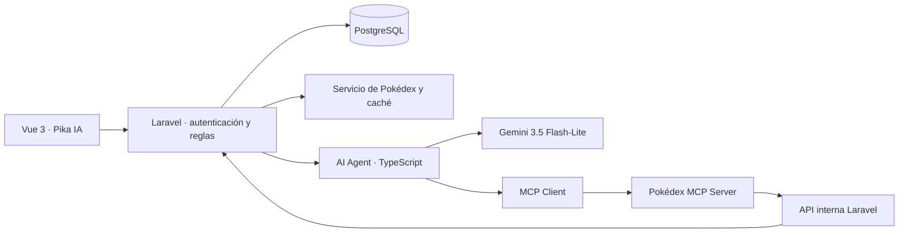

# Pokédex Manager

Aplicación local para explorar la Pokédex y administrar una colección personal. Usa Laravel 13, Inertia, Vue 3 con TypeScript, PostgreSQL y Docker mediante Laravel Sail.

## Inicio rápido

Requisitos: Docker Desktop en ejecución. Los comandos del proyecto se ejecutan mediante Sail.

```bash
cp .env.example .env
vendor/bin/sail up -d
vendor/bin/sail artisan key:generate
vendor/bin/sail artisan migrate
vendor/bin/sail npm install
vendor/bin/sail npm run build
```

La aplicación queda disponible en `http://localhost`. Para detener los contenedores sin perder datos:

```bash
vendor/bin/sail stop
```

Para eliminar también el volumen local de PostgreSQL y reiniciar sus datos:

```bash
vendor/bin/sail down -v
```

## Asistente con IA

Pika IA es el chat contextual disponible desde el botón flotante de las pantallas autenticadas. Puede consultar la colección, resumirla, buscar Pokémon, comparar entre dos y cuatro opciones y preparar altas o bajas. Las conversaciones, mensajes y acciones pendientes se guardan en PostgreSQL.

El modelo configurado es `gemini-3.5-flash-lite`, consumido exclusivamente desde un servicio server-side mediante el SDK oficial `@google/genai`. La clave nunca se expone a Vue ni se almacena en una variable `VITE_*`.



### Por qué hay dos servicios internos

- `ai-agent` orquesta Gemini y el ciclo de llamadas a herramientas. No accede a PostgreSQL.
- `pokedex-mcp` implementa MCP sobre Streamable HTTP y traduce herramientas tipadas a operaciones específicas de la API interna de Laravel. Tampoco accede a PostgreSQL.
- Laravel conserva la autoridad sobre sesión, identidad, ownership, reglas de colección, catálogo y persistencia.

Los servicios se comunican dentro de la red de Docker y no publican puertos al host.

### Herramientas disponibles para Gemini

- `get_my_collection`
- `get_my_pokemon`
- `get_collection_summary`
- `search_pokemon_catalog`
- `get_pokemon`
- `compare_pokemon`
- `request_add_pokemon_to_collection`
- `request_remove_pokemon_from_collection`

La herramienta interna `execute_confirmed_collection_action` no se entrega al modelo. Solo la invoca el AI Agent después de que Laravel recibe una confirmación autenticada desde la interfaz.

### Identidad, seguridad y confirmaciones

Gemini no recibe ni elige `user_id`. Laravel genera un contexto opaco, firmado y de corta duración con el usuario y la conversación derivados de la sesión. La API interna vuelve a validar ese contexto y aplica autorización.

Agregar y eliminar siguen este flujo:

1. Pika IA solicita una acción pendiente, sin modificar la colección.
2. Vue muestra una tarjeta estructurada con la consecuencia exacta.
3. La persona confirma o cancela mediante un endpoint autenticado.
4. Laravel comprueba ownership, estado y expiración.
5. La ejecución confirmada usa bloqueo transaccional e idempotencia antes de modificar PostgreSQL.

No se persisten instrucciones del sistema ni razonamiento privado del modelo. El historial enviado a Gemini está limitado a los mensajes recientes configurados.

### Configuración

Completa estas variables en `.env`:

```dotenv
GEMINI_API_KEY=
GEMINI_MODEL=gemini-3.5-flash-lite
GEMINI_FALLBACK_MODEL=gemini-3.1-flash-lite
GEMINI_TIMEOUT_MS=40000
AI_AGENT_TIMEOUT=90
MCP_LARAVEL_TIMEOUT_MS=12000
AI_AGENT_URL=http://ai-agent:3100
AI_SERVICE_SECRET=local-development-service-secret
ASSISTANT_CONTEXT_SECRET=local-development-context-secret
```

Las credenciales incluidas en `.env.example` son únicamente valores de desarrollo local. Sustitúyelas en cualquier entorno compartido o desplegado.

Tras cambiar variables del asistente, recrea los servicios:

```bash
vendor/bin/sail up -d --force-recreate ai-agent pokedex-mcp laravel.test
```

Puedes verificar su estado con:

```bash
vendor/bin/sail ps
```

### Ejemplos para probar Pika IA

- «¿Cuál es mi Pokémon más rápido?»
- «¿Qué tipos me faltan?»
- «Compara Pikachu con Jolteon»
- «¿Qué Pokémon me recomiendas agregar?»
- «Agrega Mew» — muestra confirmación antes de guardar.
- «Elimina Pikachu» — muestra confirmación y advierte sobre los datos personales asociados.

## Desarrollo y verificación

```bash
# Frontend en desarrollo
vendor/bin/sail npm run dev

# Laravel
vendor/bin/sail artisan test --compact
vendor/bin/sail bin pint --format agent

# Vue y TypeScript
vendor/bin/sail npm run test:frontend
vendor/bin/sail npm run type-check
vendor/bin/sail npm run build

# Servicios TypeScript
vendor/bin/sail npm --prefix services/ai-agent test
vendor/bin/sail npm --prefix services/ai-agent run build
vendor/bin/sail npm --prefix services/pokedex-mcp test
vendor/bin/sail npm --prefix services/pokedex-mcp run build

# Validación de Docker Compose
vendor/bin/sail config
vendor/bin/sail ps
```

Las pruebas del chat usan dobles para Gemini y los servicios externos; la suite no consume cuota ni requiere una clave real. Una prueba manual con respuestas reales sí requiere `GEMINI_API_KEY`.
